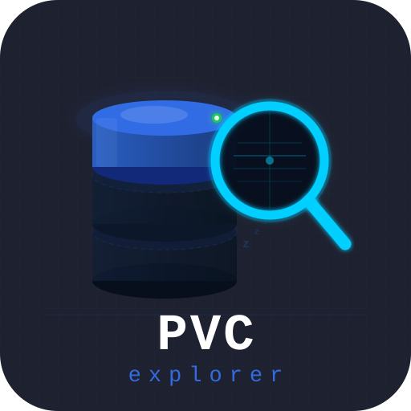

	<picture>
		<source media="(prefers-color-scheme: dark)" srcset="docs/branding/logo.svg">
		<source media="(prefers-color-scheme: light)" srcset="docs/branding/logo-light.svg">
		
	</picture>

# Welcome to the PVC Explorer Operator Organization

**PVC Explorer Operator** is a suite of open-source tools for managing and exploring Kubernetes PersistentVolumeClaims (PVCs) with safety, automation, and a modern UI.

---

## Projects in this Organization

### 1. pvc-explorer
A Kubernetes controller for browsing PersistentVolumeClaims on demand. It safely manages agent pods, scaling them to zero when not in use, and waking them up for interactive sessions. 
- [Repository](https://github.com/pvc-explorer-operator/pvc-explorer)

### 2. pvc-explorer-agent
A lightweight HTTP file-browser agent that mounts a PVC and exposes its contents over a REST API. It is designed to be ephemeral and secure, only running when needed.
- [Repository](https://github.com/pvc-explorer-operator/pvc-explorer-agent)

### 3. demo
A standalone mockup of the PVC Explorer UI for preview and testing. No real Kubernetes cluster is required; all data is simulated.

- [Repository](https://github.com/pvc-explorer-operator/demo)
- [Live Demo Site](https://demo.pvc-explorer-operator.ricardoleal.me)

---

## Community & Contribution

- [Code of Conduct](../CODE_OF_CONDUCT.md)
- [Contributing Guide](../CONTRIBUTING.md)
- [Security Policy](../SECURITY.md)

We welcome contributions of all kinds! Check out the repositories above to get started, or open an issue if you have questions or ideas.

---

## About

This organization is an experiment in human–AI collaboration, with much of the code and documentation developed using AI-based tools. We believe in open source, transparency, and making Kubernetes storage easier for everyone.

---

  <em>Browse, explore, and automate your PVCs—safely and efficiently.</em>

